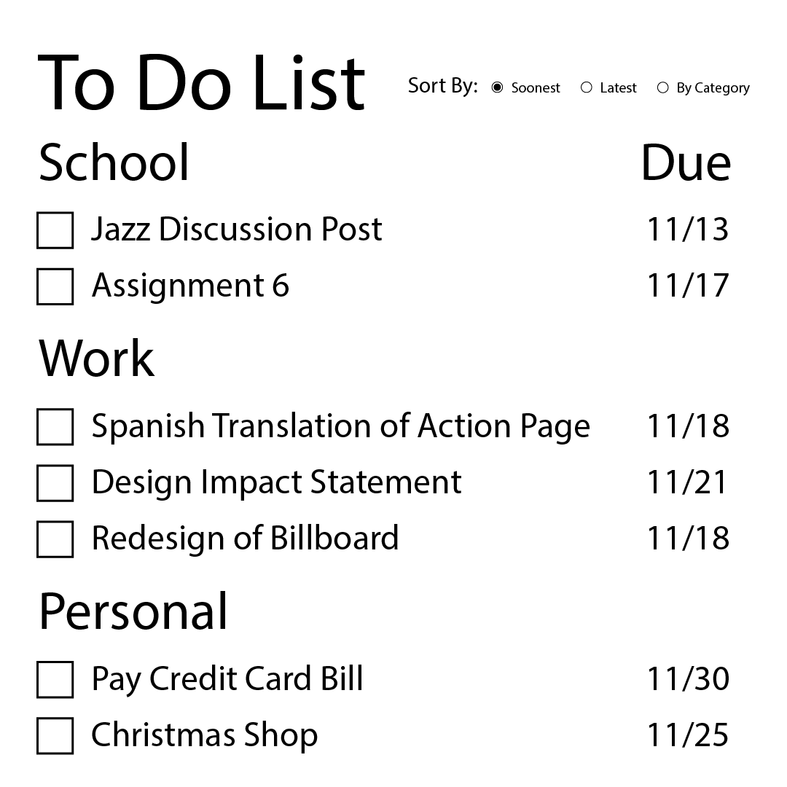
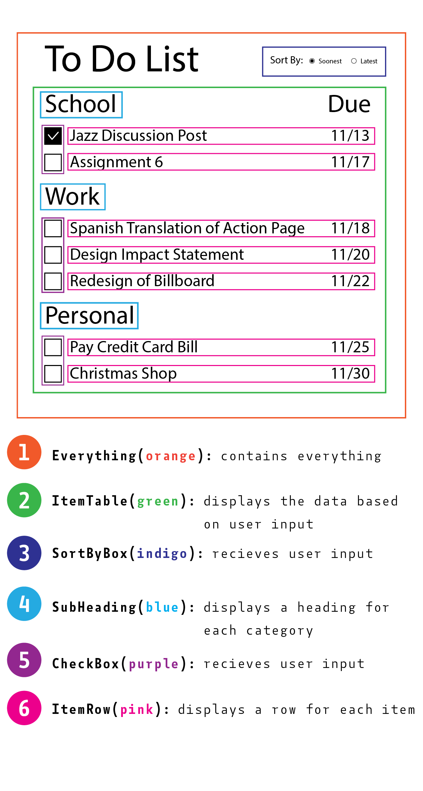

# Assignment 6 Plan

Mock Up

Component Hierarchy

- Everything 
    - SortByBox
    - ItemTable
        - Subheading
        - ItemRow
        - CheckBox

Everything will hold all of the other components. ItemTable will hold Subheading, ItemRow, and CheckBox. SortByBox will determine how the ItemRows are organized. CheckBox and SortByBox will take in user input. ItemRow, CheckBox, and SortByBox will change apperance (or order) in response to user input. 